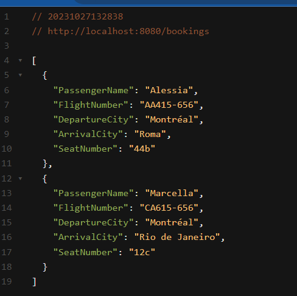
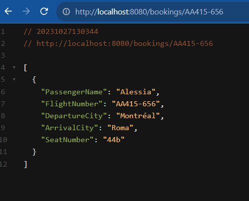
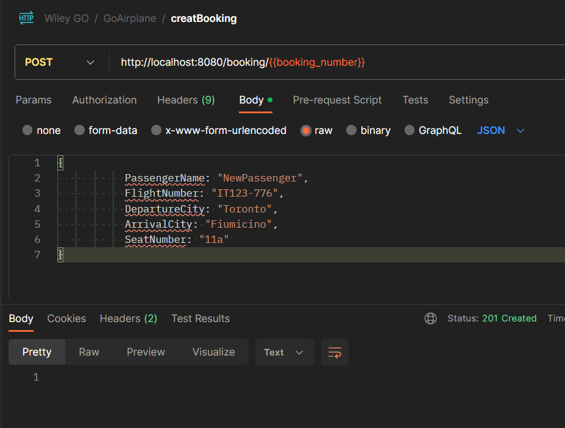
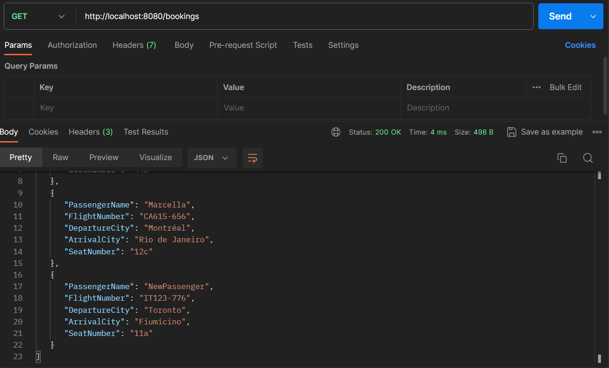

# GoAirPlane API

GoAirPlane is a simple API project written in Go that provides booking information for flights. It allows you to list all bookings, find bookings by flight number, and remove bookings from the database.

## Table of Contents

- [Getting Started](#getting-started)
- [Prerequisites](#prerequisites)
- [Installation](#installation)
- [Usage](#usage)
- [Functions and Syntax](#functions-and-syntax)

## Getting Started

GoAirPlane API is a simple RESTful service built using the Gorilla Mux router to handle requests. It provides three main functions:

1. List all flight bookings.
2. Find flight bookings by flight number.
3. Remove flight bookings by flight number.

## Prerequisites

Before getting started, ensure that you have the following prerequisites installed:

- Go (Golang) - [Installation Guide](https://golang.org/doc/install)

## Installation

1. Clone the project to your local machine:

   ```
   git clone https://github.com/your-username/GoAirPlane.git
   Change your working directory to the project folder:
   ```

cd GoAirPlane
Build the project:
`go build`

Run the project: `go run main.go`

The API server will start, and you can access it at http://localhost:8080.

Usage
The GoAirPlane API provides the following endpoints:

    GET /bookings: List all flight bookings.

    GET /bookings/{flightNumber}: Find flight bookings by flight number.

    DELETE /bookings/{flightNumber}: Remove flight bookings by flight number.

You can access these endpoints using tools like curl or by integrating the API with your applications.

## Functions and Syntax
Here are the key functions and their syntax used in the project:

#### main Function

Description: The entry point of the program that sets up the HTTP server and handles routing.

```go
    func main() {
        r := mux.NewRouter()
        r.HandleFunc("/bookings", listBookings).Methods("GET")
        r.HandleFunc("/bookings/{flightNumber}", findBookingByFlight).Methods("GET")
        r.HandleFunc("/bookings/{flightNumber}", removeBookingHandler).Methods("DELETE")
         r.HandleFunc("/bookings/{flightNumber}", createBookingHandler).Methods("POST")

        http.Handle("/", r)
        if err := http.ListenAndServe(":8080", nil); err != nil {
            fmt.Println(err)
        }
    }
```

#### listBookings Function

Description: Lists all flight bookings in JSON format.

```go
    func listBookings(w http.ResponseWriter, r *http.Request) {
        bookingsJSON, err := json.Mar al(database.Bookings)
        if err is not supported in module mode.
        }
        w.Header().Set("Content-Type", "application/json")
        w.Write(bookingsJSON)
```



#### findBookingByFlight Function

Description: Finds flight bookings by flight number and returns them in JSON format.

Syntax:

```go
    func findBookingByFlight(w http.ResponseWriter, r *http.Request) {
        params := mux.Vars(r)
        flightNumber := params["flightNumber"]
        matchingBookings := []database.Booking{}
        for _, booking := range database.Bookings {
            if booking.FlightNumber == flightNumber {
                matchingBookings = append(matchingBookings, booking)
            }
        }
        bookingsJSON, err := json.Mar al(matchingBookings)
        if err != nil {
            http.Error(w, "Error encoding bookings to JSON", http.StatusInternalServerError)
            return
        }
        w.Header().Set("Content-Type", "application/json")
        w.Write(bookingsJSON)
    }
    removeBookingHandler Function
```



#### Description: Removes flight bookings by flight number.

```go
    func removeBookingHandler(w http.ResponseWriter, r *http.Request) {
        params := mux.Vars(r)
        flightNumber := params["flightNumber"]
        for i, booking := range database.Bookings {
            if booking.FlightNumber == flightNumber {
                database.Bookings = append(database.Bookings[:i], database.Bookings[i+1:]...)
                w.WriteHeader(http.StatusNoContent)
                return
            }
        }
        http.Error(w, "Booking not found", http.StatusNotFound)
    }
```

#### Description: Creates a new flight booking.

```go
func createBookingHandler(w http.ResponseWriter, r *http.Request) {
	params := mux.Vars(r)
	flightNumber := params["flightNumber"]

	// extract the booking details from the JSON in the request
	var newBooking database.Booking
	decoder := json.NewDecoder(r.Body)
	if err := decoder.Decode(&newBooking); err != nil {
		http.Error(w, "Error decoding request body", http.StatusBadRequest)
		return
	}

	for _, booking := range database.Bookings {
		if booking.FlightNumber == flightNumber {
			w.WriteHeader(http.StatusConflict)
			w.Write([]byte("This booking already exists!"))
			return
		}
	}

	database.Bookings = append(database.Bookings, newBooking)
	w.WriteHeader(http.StatusCreated)
}
```




